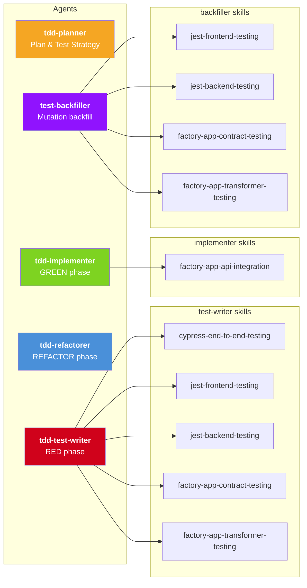
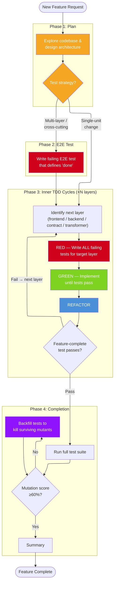

# Agentic Gold-Standard Development

In the last few months, something shifted - rather than using chatbots to make code edits, I've been able to rely on agentic coding - Claude Code, to write implementation code. It used to take longer to correct what the agent wrote than to just write the code myself. With Opus 4.5 and now 4.6, this is no longer the case.

With this increase in implementation firepower however, **I haven't noticed the same increase in test firepower**. When asking Claude Code to write tests, I find the they are inevitably:
- Coupled to implementation details
- Unit-y
- Mockist and brittle, and
- Missing coverage

I feel like I have rocket launcher level development firepower, and water pistol level testing power. Not rectified, this spells disaster.

## Tests are crucial
Now that agents are able to produce high quality implementation code more cheaply and more quickly than most engineers can, implementation becomes trivial. Quickly, problems arise:

* How do we ensure new features behave as we expect?
* How do we ensure that these changes haven't broken something on the other side of the codebase?
* How do we ensure the system continues to behave as we expect over time?

When implementation becomes trivial, the behaviour of the system becomes the most important artifact. 

In my view, the best way to encode the expected behaviour of the system is in tests. Consider the other ways of encoding expectations about system behaviour:
| Method | Limitation |
|--------|------------|
| Code Reviews | Manual, easy to miss subtle changes/implications |
| Documentation | Quickly goes out of date because there's no impetus to keep it up-to-date |
| Manual Testing | Good luck clicking through your entire app after every change to make sure it still works |

The only scalable way to assert the behaviour of the system is with automated tests. Automated tests are special in that they document the behaviour of the system, but they also are executable, and their output tells you if the system aligns with those expectations.

Imagine an entire application which is created with AI agents. Unless the AI agents have equal ability to write implementation code as well as assert and communicate the system's behaviour, that application is doomed. The reason is that the behaviour of the system quickly becomes impossible to reign in without tests. Changes that subtly break other features, or behaviour which isn't exactly what you wanted but looks good on the surface - these kinds of problems become harder and harder to fix as the amount of implementation code increases.

## Principles, amplified
At Pivotal Labs, we applied Extreme Programming (XP) and Lean Software Development principles to ensure quality. XP takes established best principles, and turns them up to 10. In the case of testing, it means writing the tests first and having them drive the implementation. In particular, Test Driven Development (TDD) imposes a "Red-Green-Refactor" methodology, which requires developers to write failing tests first (which fail for the right reason), write just implementation code to get them to pass, and then refactor the code and tests for readability.

This has the benefit of ensuring:
1. The tests actually fail for the right reasons (i.e. not always passing / false positive tests)
2. The tests are written to expect outcomes, not implementation details (i.e. not coupled)
3. The implementation that was written is guarded by the tests (as in, that behaviour is now ensured by the test suite)
4. After refactoring, both the implementation and test files are clean and maintainable (so it remains readable)

The discipline of writing the tests first is a forcing function for quality and ensuring the behaviour spec is up to date. 

## Gold Standard development
In my view, Gold Standard development involves the following workflow:
1. **Clean slate**: Developers start new features in a codebase with tests across layers: unit, integration, contract, and end-to-end tests. These tests should clearly communicate the behaviour of the system and assert it based on outcomes, not implementation details. The codebase has code style and type rules. Running and writing these tests is simple and well documented. 
2. **Feature Complete E2E test**: Developers follow outside in TDD. They write a browser-based, "feature complete" journey test - a test which embodies a user's journey through the application, performing all the steps they will take, then asserting the outcome. Once this end-to-end test is failing for the right reasons (ie. the feature doesn't exist yet), they move to the next step.
3. **Inner Red**: Developers identify why the E2E test is failing. Is it an aspect of the frontend that's failing? The backend? Both? From there, the developer writes a failing test at the unit level.
4. **Inner Green**: Developers then implement the minimum code to get their test to pass. 
5. **Inner Refactor**: Developers then refactor the test and implementation code as needed.
6. **Evaluate**: The developer then re-evaluates. Was that cycle enough to complete the feature? If so, they re-run the E2E test to ensure it's working. Otherwise, they continue with RGR cycles until the feature is complete - which they'll only know once the E2E test is passing.
7. **Mutate**: Since TDD isn't perfect, there could be scenarios where the code is untested. Running mutation testing and backfilling tests ensures that the behaviour of the system is fully asserted.

## Automating the workflow
I wondered if I could get Claude Code to go through this workflow. Through some searching, I found https://alexop.dev/posts/custom-tdd-workflow-claude-code-vue/. In that article, the author sets up agents and skills to encode Red-Green-Refactor cycles for Vue frontend development. I tried it myself, and it worked. The author's setup only includes unit tests, and single RGR cycles. Instead, I sought to make the whole workflow - outside in, across test layers

I then attempted to get this outside in TDD workflow going.

## Skills vs. Agents
Skills instructions which can be loaded by agents, and help them understand how to do tasks. 
Agents on the other hand, are instances of the AI agent. They have their own context window, and can be given explicit personas or scope within which they operate.

We have to play the game of context. The reason we don't have superhero agents who have loaded ALL skills is because that eats up context. The context window is limited, so we need to ensure separation of responsibility. Skills enable the agents to understand how to work on certain tasks, and we can separate the agents by function, and load skills only when required.

In order to get Claude Code to do Outside-in TDD, I created the following structure:
| Agent | Purpose |
|-------|---------|
| `tdd-planner` | Take the initial feature request, explore the codebase, determine the highest level test necessary to assert the feature is complete, plan the implementation |
| `tdd-test-writer` | Write tests given behavioural requirements |
| `tdd-implementer` | Implement the behaviour that the tests assert |
| `tdd-refactorer` | Clean up the tests and implementation |
| `test-backfiller` | Backfill tests highlighted as missing by mutation testing |

| Skill                      | Purpose |
|----------------------------|---------|
| `cypress-end-to-end-testing` | Writing end to end tests in Cypress |
| `contract-testing`           | Writing contract tests against a third party API |
| `jest-backend-testing`       | Writing backend library and API tests |
| `jest-frontend-testing`      | Writing frontend component tests |
| `outside-in-tdd`             | Orchestrating the agents |

They're associated as such:

You'll see that the `tdd-implementer` only has a single skill which helps it with a third party API integration. This is because the model is already very talented at working in Next.js and Prisma. As such, I can use the agent definition itself to provide any specific gotchas. 

The `tdd-test-writer` on the other hand needs separate skills. This is because testing in the frontend vs. backend vs. e2e (in cypress) takes significantly more instructions to get right. 

