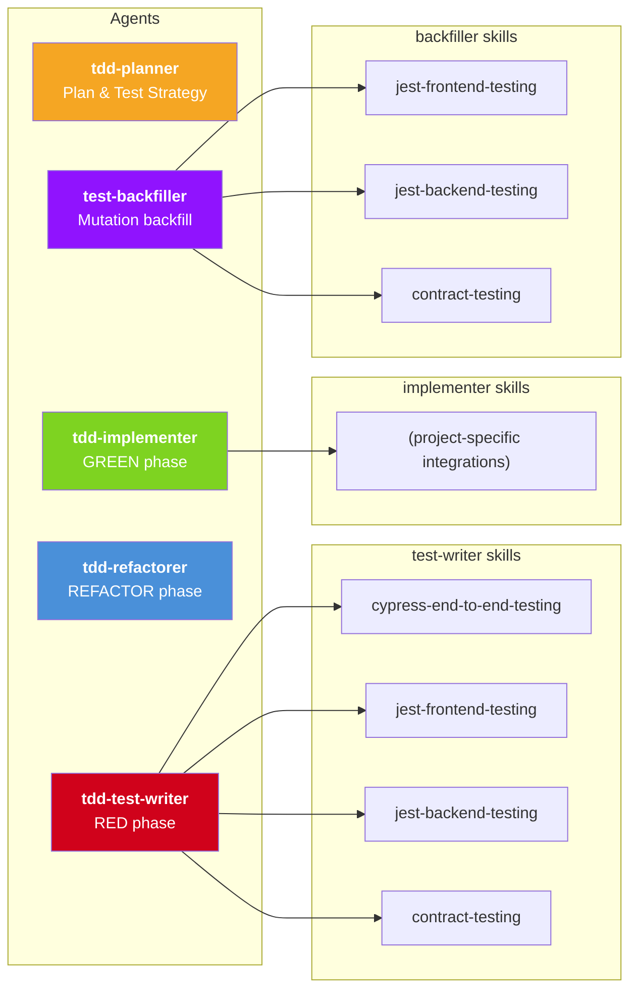

# Principled Agentic Software Development

**TLDR**: Using Agent and Skill definitions, you can encode engineering principles and practices like **Outside-in Test-Driven Development**, **Mutation testing**, and others into workflows that agents actually follow.

I've found this significantly increases test quality, implementation quality, as well as my ability as a developer to assert that what was built was the right thing, and the product continues to behave expected over time. 

Try it out for yourself:

https://github.com/JoeGaebel/outside-in-tdd-starter

## Intro
In the last few months, something shifted - rather than using chatbots to make code edits, I've been able to rely on agentic coding - Claude Code, to write implementation code. It used to take longer to correct what the agent wrote than to just write the code myself. With Opus 4.5 and now 4.6, this is no longer the case.

The models have leveled up. It's now possible to "one-shot" whole features with a single prompt. Plug in planning steps, MCP servers, orchestration, and you've got a very powerful engine for writing implementation.

**Big caveat: It struggles with testing.**

With this increase in implementation firepower, **I haven't noticed the same increase in test firepower**. When asking Claude Code to write tests, I find they are inevitably coupled to implementation details, mockist, brittle, and missing coverage. It's like a powerful motorcycle with a tiny front-wheel: lots of implementation power, but limited steering. Without equal ability to test, verify, and control the behaviour of the application, how can developers rely on AI generated code in the long-term?

This fact alone should be a major cause for concern. If AI is writing the code, how can we ensure our products continue to behave as they should? In a world where implementation is trivial, being able to assert the behaviour of the system becomes paramount. Ensuring agents get testing right is crucial for product success.

## Tests are crucial

Now that agents are able to produce high quality implementation code more cheaply and more quickly than most engineers can, implementation becomes trivial. Quickly, problems arise:

* How do we ensure new features behave as we expect?
* How do we ensure that these changes haven't broken something on the other side of the codebase?
* How do we ensure the system continues to behave as we expect over time?

When implementation becomes trivial, the behaviour of the system becomes the most important artifact.

In my view, the best way to encode the expected behaviour of the system is in tests. Consider the other ways of encoding expectations about system behaviour:
| Method | Limitation |
|--------|------------|
| Code Reviews | Manual, easy to miss subtle changes/implications |
| Documentation | Quickly goes out of date because there's no impetus to keep it up-to-date |
| Manual Testing | Good luck clicking through your entire app after every change to make sure it still works |

The only scalable way to assert the behaviour of the system is with automated tests. Automated tests are special in that they document the behaviour of the system, but they also are executable, and their output tells you if the system aligns with those expectations.

Imagine an entire application which is created with AI agents. Unless the AI agents have equal ability to write implementation code as well as assert and communicate the system's behaviour, that application is doomed.

This is because the behaviour of the system quickly becomes impossible to reign in without tests. Changes that subtly break other features, or behaviour which isn't exactly what you wanted but looks good on the surface - these kinds of problems compound as the amount of implementation code increases.

## Why does AI struggle with testing?

Unless told otherwise, agents will write the implementation first, then go back and write tests. This makes the tests:
- **Coupled to implementation** - they test implementation details, not behaviour
- **Potentially always passing / false positive** - tests written after the fact may never actually fail
- **Unit-level and mocking everything** - they encode assumptions about the other units within the tests
- **Missing coverage** - gaps that go unnoticed

Higher value tests like integration, end-to-end and journey tests require more setup and context than unit tests. To write these tests, developers need to know:
- Testing conventions for the areas of code they're changing
- What containers or dependencies need to be running to support the tests
- Which commands to run
- The domain context - what is the user value the feature is delivering, and how can they assert this at the whole-application level

AI agents can't figure this out by themselves, so they default to backfilling unit tests which mock everything, and may not even run the tests they write.

This represents a growing problem: significant implementation throughput, bottlenecked at quality assurance.

## Engineering principles to the rescue

There are tried and true engineering principles that help software engineers bake quality into their work. Test-Driven Development, Lean Software Development, Clean Code, and others.

What if these principles could be encoded into a workflow that agents follow?

It turns out, this can be done with a combination of agents and skills. First, the principles, and how they help:

### Test-Driven Development (TDD)

At Pivotal Labs, we applied Extreme Programming (XP) and Lean Software Development principles to ensure quality. XP takes established best practices and turns them up to 10. In the case of testing, it means writing the tests first and having them drive the implementation.

In Test-Driven Development, you follow Red, Green, Refactor cycles (RGR):
1. **Red** - You write the tests first, run them and see them fail
2. **Green** - You write just enough implementation code to make them pass
3. **Refactor** - You refactor the code for maintainability and readability

This is a forcing function for:
1. **Understanding behaviour** - The tests actually fail for the right reasons (i.e. not always passing / false positive tests)
2. **Decoupled tests** - The tests are written to expect outcomes, not implementation details
3. **Guarded implementation** - The implementation that was written is covered by the tests (that behaviour is now ensured by the test suite)
4. **Clean code** - After refactoring, both the implementation and test files are clean and maintainable

The discipline of writing the tests first is a forcing function for quality and ensuring the behaviour spec is up to date.

This is a massive improvement in test and implementation quality over writing the tests after the fact. However, TDD could still be applied with just unit tests - hindering our ability to comprehensively assert the behaviour of the system, and filling our test suites with brittle, mockist tests.

### Outside-In TDD

Outside-In TDD incorporates the different levels of testing into TDD in order to more comprehensively assert user value and system behaviour.

It requires understanding the different scopes of testing within the system. In codebases, this generally looks like:

| Test type | Scope | Speed | Value |
|-----------|-------|-------|-------|
| Unit (Jest / JUnit / etc) | A single unit | Fast | Low (brittle, coupled to unit structure) |
| Integration | Multiple units | Slower | Medium (larger scope, uncoupled to unit structure) |
| End-to-End (Cypress / Playwright) | Whole system | Slower | High (shows the system works across layers) |
| Journey | User's whole journey through the system | Slowest | Maximum (validates the application actually delivers user value for a given use-case/journey) |

In Outside-In TDD, the engineer is responsible for creating a feature acceptance test, asking: "What is the lowest level test with which I can assert that the feature is complete?" Some features only require a unit test. Other features require extending or creating a new journey test.

Once the feature acceptance test is written, lower level Red-Green-Refactor cycles can take place to build the feature piece by piece. The engineer knows they are done when the feature-complete test passes.

This involves a clear traversal through the test layers - writing tests at the right layer to ensure the user value we want to deliver is asserted within the tests.

### Mutation Testing

Mutation testing is a tool for determining with confidence if implementation code is completely tested. Code coverage isn't this - code coverage is easily gamed - a test that traverses the code path but makes no assertions still yields 100% "coverage".

Mutation testing mutates the source code meaningfully (think turning ANDs to ORs), and then re-runs the tests. If the tests don't fail, that code isn't tested.

TDD when run strictly significantly improves implementation being covered by tests - but it's not perfect. Mutation testing can be added to ensure that this coverage is added systematically.

## Principled Development

Principled Development* utilises Outside-In TDD with mutation testing. It involves:
- **Planning** the feature from a user's perspective - what user value are we trying to deliver
- **Writing the Feature Complete test** (the lowest level test that the full value of the feature can be asserted - for features that touch multiple units, this usually means an end-to-end test)
- **Performing Red-Green-Refactor cycles** until the feature-complete test passes
- **Running mutation testing** to ensure there are no holes in testing, and backfilling tests where missing

In detail, the workflow looks like this:
1. **Clean slate**: Developers start new features in a codebase with tests across layers: unit, integration, contract, and end-to-end tests. These tests should clearly communicate the behaviour of the system and assert it based on outcomes, not implementation details. The codebase has code style and type rules. Running and writing these tests is simple and well documented.
2. **Feature Complete test**: Developers follow Outside-In TDD. They write a "feature complete" acceptance test - a test which embodies a user's journey through the application, performing all the steps they will take, then asserting the outcome. Once this test is failing for the right reasons (ie. the feature doesn't exist yet), they move to the next step.
3. **Inner Red**: Developers identify why the feature-complete test is failing. Is it an aspect of the frontend that's failing? The backend? Both? From there, the developer writes a failing test at the appropriate layer.
4. **Inner Green**: Developers then implement the minimum code to get their test to pass.
5. **Inner Refactor**: Developers then refactor the test and implementation code as needed.
6. **Evaluate**: The developer then re-evaluates. Was that cycle enough to complete the feature? If so, they re-run the feature-complete test to ensure it's working. Otherwise, they continue with RGR cycles until the feature is complete - which they'll only know once the feature-complete test is passing.
7. **Mutate**: Since TDD isn't perfect, there could be scenarios where the code is untested. Running mutation testing and backfilling tests ensures that the behaviour of the system is fully asserted.

\*This is just my opinion of what principled development includes. I'm sure there are other principles that could be encoded - Clean Code, User-Centred Design, Lean Software Development, etc. In my view, the definition of principled development I'm presenting significantly increases agent output quality, both of tests and implementation, and offers an example of how we can encode an organisation's definition of quality into agentic workflows.

## Teaching agents

Agents are now very good at following instructions. Through a combination of sub-agents and skills, they can follow a principled development workflow.

The rigour of the workflow - starting with a feature-complete test, writing the tests first, and only then writing implementation - significantly increases quality of both tests and implementation. It's the rigour of the workflow which enables high quality.

### Sub-agents

These are like personas - Test Writer, Implementer, Orchestrator. Agent definitions describe the workflow and lifecycle of an agent. It's called a sub-agent because your primary agent you're speaking with in the terminal window spawns these itself.

Sub-agents have their own context window, which allows them to focus on a specific set of tasks without losing track of their goal, and without running out of context size. These agent definitions are just `.md` files written in english for how this agent should behave.

### Skills

Skills are instructions that agents can load that tell the agent how to do certain tasks. Rather than making the agent gather context and figure out how to do something itself (and make assumptions, or get it wrong), this information can be encoded into skills.

Skills are loaded on-demand. This helps reduce context usage, so the agent only loads skills when they're needed.

### Workflow

Workflows can be encoded as a skill that your main agent takes on. It becomes an orchestrator that invokes sub-agents and manages them through the workflow.

We have to play the game of context. The reason we don't have superhero agents who have loaded ALL skills is because that eats up context. The context window is limited, so we need to ensure separation of responsibility. Skills enable the agents to understand how to work on certain tasks, and we can separate the agents by function, and load skills only when required.

## In practice

Outside of my day job, I build software for my aluminium fabrication company. There's functionality around time tracking and forecasting that needed to be built for how the business runs.

I was spending a lot of time getting Claude Code to try to embody these principles, and came upon [this blog post](https://alexop.dev/posts/custom-tdd-workflow-claude-code-vue/). In it, the author describes how he used agents and skills to perform TDD loops for Vue frontend development. I tried it, and it worked!

The author's setup only includes unit tests, and single RGR cycles. So from there, I grew it to encapsulate Outside-In TDD with mutation testing, and a few other enhancements.

Here's my setup:

| Agent | Purpose |
|-------|---------|
| `tdd-planner` | Take the initial feature request, explore the codebase, determine the highest level test necessary to assert the feature is complete, plan the implementation |
| `tdd-test-writer` | Write tests given behavioural requirements |
| `tdd-implementer` | Implement the behaviour that the tests assert |
| `tdd-refactorer` | Clean up the tests and implementation |
| `test-backfiller` | Backfill tests highlighted as missing by mutation testing |

| Skill                      | Purpose |
|----------------------------|---------|
| `cypress-end-to-end-testing` | Writing end to end tests in Cypress |
| `contract-testing`           | Writing contract tests against a third party API |
| `jest-backend-testing`       | Writing backend library and API tests |
| `jest-frontend-testing`      | Writing frontend component tests |
| `outside-in-tdd`             | Orchestrating the agents |

They're associated as such:

The `tdd-implementer` only has a single skill which helps it with a third party API integration. This is because the model is already very talented at working in Next.js and Prisma. As such, I can use the agent definition itself to provide any specific gotchas.

The `tdd-test-writer` on the other hand needs separate skills. This is because testing in the frontend vs. backend vs. e2e (in Cypress) takes significantly more instructions to get right.

### The workflow in action

Here's how it works in detail

1. You ask your coding agent: "Hey, I want you to implement Dark mode in the app please. Use outside-in-tdd".
2. The agent you're talking to loads the `outside-in-tdd` skill, and learns that it is now the orchestrator of this workflow.
3. It then spins up a `tdd-planner` sub-agent, which scans the codebase, understands the feature spec and how it would fit into the application - and crucially, the user value it should deliver. It then determines what is the lowest level test that could be written to ensure that value is delivered.
4. The orchestrator spins up a `tdd-test-writer` agent, and passes it the test plan - what behaviour it should assert is present in the application. `tdd-test-writer` figures out what kind of test it is (backend/frontend/end-to-end) and loads the associated skill. It then writes the test, ensures it fails for the right reason, and yields back to the orchestrator.
5. The orchestrator now knows where the feature-complete test is. If this was an end-to-end test, it will invoke the `tdd-test-writer` agent to write a test at a lower level to begin the Red-Green-Refactor cycles. In the case of a small feature, the feature-complete test might be a unit or integration test, and in that case, the next move is to invoke the `tdd-implementer`.
6. The `tdd-implementer` gets invoked with the test it needs to pass and the behaviour it should implement. Since the `tdd-test-writer` was instructed to write tests that were implementation agnostic, and to focus on asserting behaviour, the `tdd-implementer` is free to implement without coupling from the test. It will implement until the tests pass, and then yield to the orchestrator.
7. The orchestrator then invokes the `tdd-refactorer` with the files that were changed/created during the testing and implementing. It knows what kind of refactors I care about (DRY, readability, etc), and implements those across files, then yields.
8. The orchestrator then runs the feature-complete test. If it passes, it knows that the feature is implemented! If it fails, it investigates, and then kicks off another Red-Green-Refactor cycle to implement the next piece of functionality.
9. Once the feature-complete test passes, the orchestrator runs mutation tests. The mutation testing script runs mutation tests on all changed files, and calculates their tested threshold. If any implementation files are missing tests, the orchestrator spins up the `test-backfiller` agent, which receives the test files, implementation files, and report from mutation testing, and is responsible for writing in the tests to fill these gaps.

### Try it for yourself!
I've extracted the workflow into a starter repo using Next.js.
It's got detailed instructions for getting started - check out the README.md.

https://github.com/JoeGaebel/outside-in-tdd-starter

## What this shows

- Agents have changed. They're capable of one-shotting features.
- Agents can follow complex workflows and instructions.
- Out of the box, our throughput for implementation code significantly outweighs our test throughput. If these remain unmatched, we risk losing control of the behaviour of our products.
- Engineering practices and principles can be encoded into workflows that agents follow, and this significantly increases code quality and an engineer's ability to verify and define the behaviour of the product.

A workflow like this gives developers and organisations the ability to significantly scale up production of high-quality software - in a way that developers can ensure the product is, and continues to behave as expected. It enables developers to review and release AI-generated features with confidence, because they were implemented aligning with engineering processes and standards.
